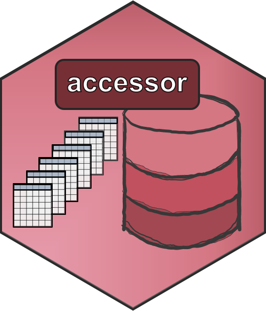

# Access Access&reg; Databases without Access to Access&reg;

Tools for accessing Access&reg; databases in the absence of access to Access&reg;.

The focal component of `accessor` (unlocking the Access&reg; database) is built on top of [`mdbtools`](http://mdbtools.sourceforge.net/) and [`unixodcb`](http://www.unixodbc.org/) software libraries and consists of a set of bash scripts with options that allow the user to target a remote (`-r`) or local (`-l`) database.
A folder (named after the database) is created and populated with `.csv` files (one for each table, named accordingly) which can then optionally be read into [`R`](https://www.r-project.org/) using a set of generalized functions. 
We package `accessor` into a stable yet flexible [`Docker`](https://www.docker.com) [software container](https://www.docker.com/resources/what-container), as written out in the [`Dockerfile`](https://github.com/dapperstats/accessor/blob/master/Dockerfile) and with an available image on [Docker Hub](https://hub.docker.com/r/dapperstats/accessor). 
Default settings are for the [`salvage` database](https://github.com/dapperstats/salvage/), but users can specify any remote or local database to be converted to `.csv`s and can automate loading of the data into `R` via command line options. 
See the [`methods description`](https://github.com/dapperstats/salvage/blob/master/documents/methods.md) for more methods descriptions and the [`salvage` repo](https://github.com/dapperstats/salvage/) to see `accessor` in action.

## Authors and Version Info

[**J. L. Simonis**](https://orcid.org/0000-0001-9798-0460) of [DAPPER Stats](https://www.dapperstats.com)

v0.4.0

If you are interested in contributing, see the [Contributor Guidelines](https://github.com/dapperstats/salvage/blob/master/CONTRIBUTING.md) and [Code of Conduct](https://github.com/dapperstats/salvage/blob/master/CODE_OF_CONDUCT.md).

[DAPPER Stats](https://www.dapperstats.com) provides this software under the [MIT License](https://opensource.org/licenses/MIT). If you are interested in applying the code to your own Access&reg;-associated situation, please [contact us](https://www.dapperstats.com/contact/)!